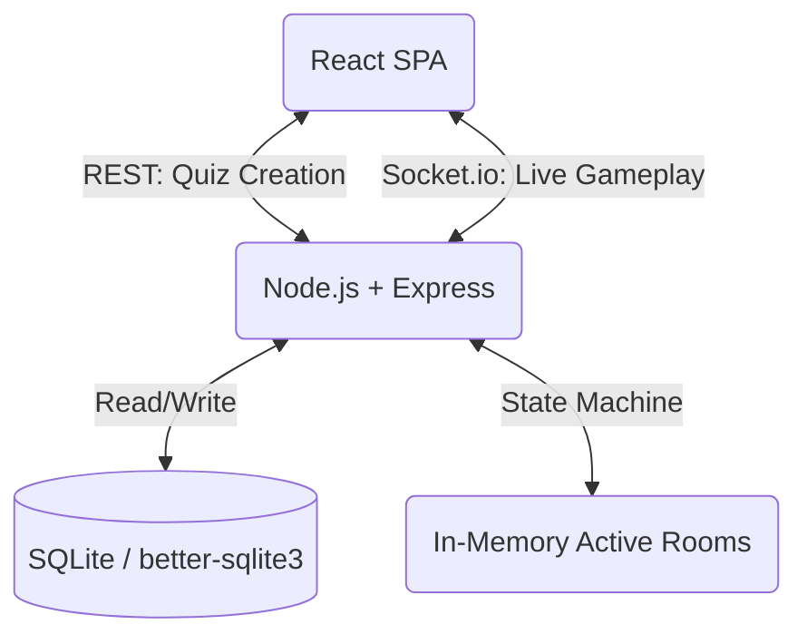

# Sparq ⚡

Sparq is a high-performance, real-time multiplayer quiz platform built for speed, interactivity, and scale. It serves as a modern alternative to platforms like Kahoot, demonstrating a clean separation of standard REST APIs and server-authoritative WebSocket state machines.

## 🚀 Features

- **Real-Time Multiplayer**: Instantaneous updates using Socket.io for lobbies, answers, and leaderboards.
- **Server-Authoritative Game State**: Clients cannot manipulate timers or scores; the server handles a strict state machine to prevent race conditions.
- **Streak Multipliers**: Answer consecutive questions correctly to build streaks (up to 1.5x score) for competitive gameplay.
- **Live Host Analytics**: The host sees live answer tallies, the fastest responder per question, and difficulty categorization dynamically computed at the end.
- **Robust Reconnection**: Players can drop off and seamlessly rejoin their session using a persistent token system without losing their score or streak.

## 🏗️ Architecture



### REST vs. Socket.io Responsibilities
- **REST APIs**: Used strictly for persistent actions, such as generating the quiz room and fetching static history. This avoids unnecessary WebSocket overhead.
- **Socket.io**: Used exclusively for transient, high-speed game state updates (timers, answers, leaderboards) managed by an in-memory `Map` to minimize database writes.

## 🛠️ Database Schema (SQLite)

- **rooms**: Stores the quiz session and current state (`WAITING`, `STARTING`, `QUESTION_ACTIVE`, `QUESTION_ENDED`, `FINISHED`).
- **questions**: Stores question text, options, correct answer, and time limit.
- **participants**: Tracks player names, tokens (for reconnection), scores, and streaks.
- **answers**: Logs every answer attempt, response time, and points awarded.

## 🏎️ Scoring Algorithm

Points are calculated using a time-decay algorithm combined with a streak multiplier:
1. **Base Points**: 500 points for a correct answer.
2. **Speed Bonus**: Up to 500 additional points based on how quickly the user answered relative to the time limit.
3. **Streak Multiplier**: Consecutive correct answers grant a 1.0x, 1.1x, 1.2x... up to 1.5x multiplier to the final score.

## 💻 Local Setup

1. **Clone the repository.**
2. **Install dependencies:**
   ```bash
   cd backend && npm install
   cd ../frontend && npm install
   ```
3. **Start the Backend:**
   ```bash
   cd backend && npm start
   ```
4. **Start the Frontend:**
   ```bash
   cd frontend && npm run dev
   ```
5. Open `http://localhost:5173` in your browser.

## 🧪 Testing
The architecture is designed for testability by decoupling the database connection (`database.js`), REST controllers (`quizController.js`), and the Socket state machine (`socketManager.js`).

## 🛡️ Security & Concurrency Handling
- **Race Condition Prevention**: The server relies on timestamps and a strict state machine to process answers, dropping any late or duplicate submissions even if clients manipulate their local clock.
- **Connection Drops**: Participant tokens handle duplicate tabs and dropped mobile connections without creating ghost players.
