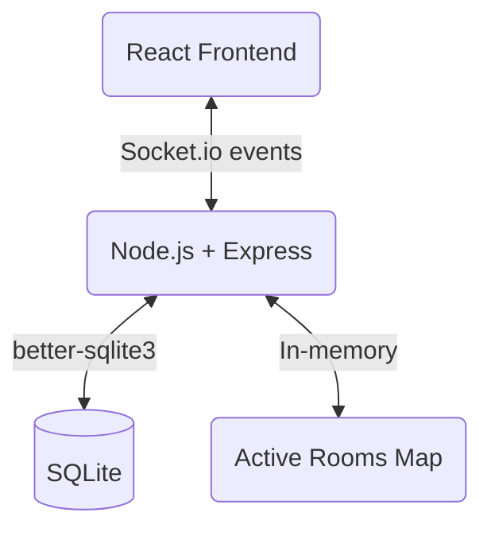

# Sparq — Phase 1, 2 & 3 Report

## Phase 1: Complete Project Audit

### Overview
Sparq is a real-time multiplayer quiz platform currently built with **Node.js, Express, Socket.io, SQLite, and React (Vite)**. The application is divided into a backend API/Socket server and a frontend React SPA.

### Game Lifecycle Trace
1. **Host Creates Quiz**: Host provides a name and a list of questions. A unique 6-character room code is generated. Questions are saved to SQLite.
2. **Players Join**: Players enter the room code and their name. A unique token is generated for reconnection and saved in local storage.
3. **Room Created/Waiting**: Host sees a lobby with the participant count. Players see a waiting screen.
4. **Timer Starts / Questions Delivered**: Host starts the quiz. The server broadcasts the first question to the room. The server sets a `setTimeout` for the question's duration.
5. **Players Answer**: Players select an option. The client computes the remaining time using the server-provided deadline timestamp.
6. **Server Validates Answers**: Server receives the answer, checks if the deadline passed, validates correctness, and calculates points based on response speed.
7. **Score Calculated / Leaderboard Updated**: Score is updated in the database. A live tally of options is sent to the host. 
8. **Next Question**: When the server timer expires, `question:ended` is emitted, broadcasting the correct answer and updating the leaderboard.
9. **Quiz Finishes**: Once all questions are answered, the host ends the quiz. Final stats and a leaderboard are broadcasted.

### File Structure & Responsibilities
- `backend/server.js`: Express setup, in-memory state tracking (`activeRooms`), and Socket.io event handlers.
- `backend/db.js`: SQLite schema definition and initialization using `better-sqlite3`.
- `frontend/src/pages/`: React components for `Home`, `HostCreate`, `HostRoom`, `PlayerJoin`, and `PlayerRoom`.
- `frontend/src/socket.js`: Socket.io client instance.

---

## Phase 2: Current Architecture Report

### Real-Time Architecture Flow

- **Socket.io** is used almost exclusively for all interactions (creating rooms, joining, answering, starting quiz). 
- **Database (SQLite)** serves as the permanent record for rooms, questions, participants, and answers.
- **In-Memory State** (`activeRooms`) tracks transient state like current question deadline, option counts, and timer handles to avoid excessive DB writes.

### Current Features
- Room creation with custom questions
- Player joining via 6-character code
- Real-time lobby updates
- Server-authoritative timer (client syncs visually to a server-provided timestamp)
- Reconnection support via tokens stored in `localStorage`
- Speed-based scoring system
- Host dashboard with live tally of answers
- Final leaderboard and per-question analytics

### Current Problems & Limitations
- **Overuse of Socket.io**: Even non-real-time actions (like creating a room and saving questions) use Socket.io instead of REST APIs.
- **Race Conditions**: `setTimeout` for the timer and asynchronous answers might occasionally overlap improperly on the edge of the deadline.
- **Monolithic Server File**: `server.js` contains all socket events, game logic, and HTTP routes, making it hard to maintain.
- **Lack of REST APIs**: Fetching past quizzes or analytics isn't implemented via REST.
- **Security**: No validation/sanitization libraries are used. No rate limiting. CORS is configured to `*`.
- **UI/UX**: The UI is functional but lacks Polish, animations, and robust error state handling.

### Current Strengths
- **Timer Architecture**: Using a server-generated deadline timestamp rather than relying on the client's clock is an excellent pattern.
- **Reconnection Logic**: The token-based reconnection is solid and well thought out.
- **In-Memory State**: Using a `Map` for transient state while relying on SQLite for permanence is a performant approach for this scale.

---

## Phase 3: Technology Review

### Database Decision: SQLite vs. MySQL
**CURRENT**: SQLite (`better-sqlite3` in WAL mode)
**PROPOSED**: SQLite (Retained with an option to easily migrate later)
**WHY**:
- SQLite with `better-sqlite3` is synchronously fast in Node.js and easily handles thousands of concurrent connections.
- It simplifies deployment significantly since it doesn't require a separate database server.
- **However**, if you specifically want to showcase **MySQL** on your resume and intend to build complex relational queries, we can migrate to MySQL using an ORM like Sequelize or Prisma. *For now, keeping SQLite but abstracting the DB layer is the safest approach to maintain the deployed version's stability.*

### Real-Time Architecture Improvements
- **REST for Persistence, Sockets for State**: Move room creation, question management, and analytics fetching to standard Express REST endpoints. Reserve Socket.io strictly for real-time game state (lobby, timers, answers).
- **State Machine**: Introduce a clear state machine for rooms (`WAITING` -> `STARTING` -> `QUESTION_ACTIVE` -> `QUESTION_ENDED` -> `FINISHED`) to prevent invalid transitions (e.g., answering after a question ends).

### Proposed Enhancements
1. **Analytics Dashboard**: Add REST APIs to fetch historical quiz data, difficult questions, and average response times.
2. **AI Question Generation (Optional)**: We can integrate a lightweight, structured LLM call (e.g., via Google Gemini) in the host dashboard to generate 5 MCQs on a given topic. This demonstrates practical, applied AI without over-engineering.
3. **Security**: Add `zod` for input validation and strict schema enforcement.
4. **Refactoring**: Split `server.js` into controllers, socket handlers, and services.

> [!IMPORTANT]
> The existing application is well-designed at its core. The focus will be on **refactoring for maintainability, separating REST from Sockets, enforcing security, and polishing the UI**.
